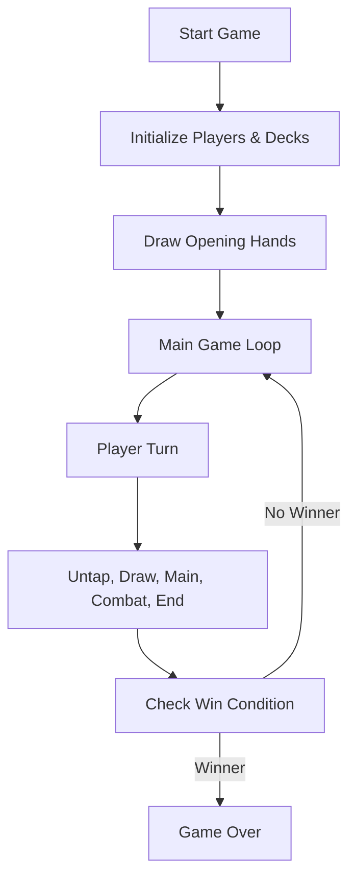

# Game Structure

## High-Level Flow

## Main Components
- **Wizard**: High-level game controller, manages turns and player actions.
- **GameEngine**: Handles game state, rules, and core logic.
- **Card Objects**: Represent creatures, lands, and spells.
- **UI (main.py)**: Handles rendering and user interaction.

## State Transitions
- State is updated after every action (play, cast, attack, etc.).
- Each phase (untap, draw, main, combat, end) is handled in sequence.

## Example Turn Flow
1. Untap step
2. Draw step
3. Main phase (play cards, lands, spells)
4. Combat phase (declare attackers/blockers, resolve damage)
5. End phase (cleanup, discard, check win)
